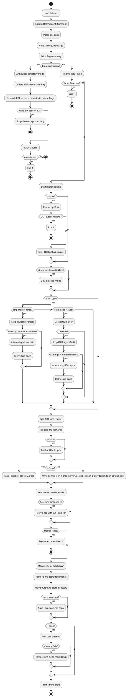

# pdftomd.sh Activity Diagram

```plantuml
@startuml
start
:Load defaults;
:Load pdftomd.conf if present;
:Parse CLI args;
:Validate required args;
:Print flag summary;

if (Input is directory?) then (yes)
  :Announce directory mode;
  :Collect PDFs (recursive if -r);
  :For each PDF -> re-run script with same flags;
  if (Child exit code >= 128?) then (yes)
    :Stop directory processing;
    stop
  endif
  :Track failures;
  if (Any failures?) then (yes)
    :Exit 1;
    stop
  else (no)
    stop
  endif
else (no)
  :Resolve input path;
  if (Input file exists?) then (yes)
  else (no)
    :Exit 1;
    stop
  endif
endif

:Init timers/logging;

if (-o/--ocr?) then (yes)
  :Run ocr-pdf.sh;
  if (OCR output missing?) then (yes)
    :Exit 1;
    stop
  endif
  :Use _OCR.pdf as source;
endif

if (strip mode forced AND -o?) then (yes)
  :Disable strip mode;
endif

if (-o not used) then (yes)
  if (strip mode = force?) then (yes)
    :Strip OCR layer (fast);
    if (Warnings -> malformed PDF?) then (yes)
      :Attempt qpdf --repair;
      :Retry strip once;
    endif
  elseif (strip mode = auto?) then (yes)
    :Detect OCR layer;
    if (Detected?) then (yes)
      :Strip OCR layer (fast);
      if (Warnings -> malformed PDF?) then (yes)
        :Attempt qpdf --repair;
        :Retry strip once;
      endif
    endif
  endif
endif

:Split PDF into chunks;
:Prepare Marker args;
if (-l/--llm?) then (yes)
  :Enable LLM helper;
endif
if (-o/--ocr?) then (yes)
  :Pass --disable_ocr to Marker;
else (no)
  :Write config_json {force_ocr=true, strip_existing_ocr=depends on strip mode};
endif

:Run Marker on chunk dir;
if (Rate limit error and -l?) then (yes)
  :Retry once without --use_llm;
endif
if (Marker failed?) then (yes)
  :Report error and exit 1;
  stop
endif

:Merge chunk markdown;
:Restore images/attachments;
:Move output to start directory;

if (--preclean-copy?) then (yes)
  :Save _preclean.md copy;
endif
if (--clean?) then (yes)
  :Run LLM cleanup;
  if (Cleanup fails?) then (yes)
    :Restore pre-clean markdown;
  endif
endif

:Print timing stats;
stop
@enduml
```
