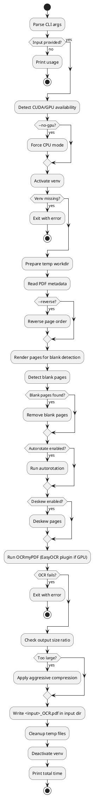

# ocr-pdf.sh Activity Diagram

```plantuml
@startuml
start
:Parse CLI args;
if (Input provided?) then (yes)
else (no)
  :Print usage;
  stop
endif

:Detect CUDA/GPU availability;
if (--no-gpu?) then (yes)
  :Force CPU mode;
endif

:Activate venv;
if (Venv missing?) then (yes)
  :Exit with error;
  stop
endif

:Prepare temp workdir;
:Read PDF metadata;
if (--reverse?) then (yes)
  :Reverse page order;
endif

:Render pages for blank detection;
:Detect blank pages;
if (Blank pages found?) then (yes)
  :Remove blank pages;
endif

if (Autorotate enabled?) then (yes)
  :Run autorotation;
endif

if (Deskew enabled?) then (yes)
  :Deskew pages;
endif

:Run OCRmyPDF (EasyOCR plugin if GPU);
if (OCR fails?) then (yes)
  :Exit with error;
  stop
endif

:Check output size ratio;
if (Too large?) then (yes)
  :Apply aggressive compression;
endif

:Write <input>_OCR.pdf in input dir;
:Cleanup temp files;
:Deactivate venv;
:Print total time;
stop
@enduml
```
